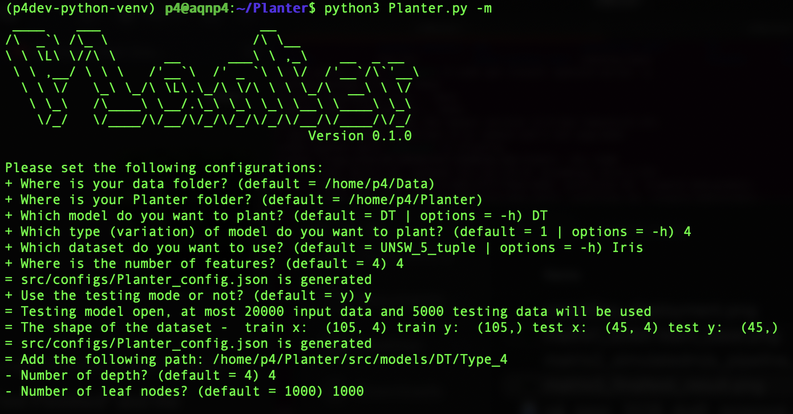
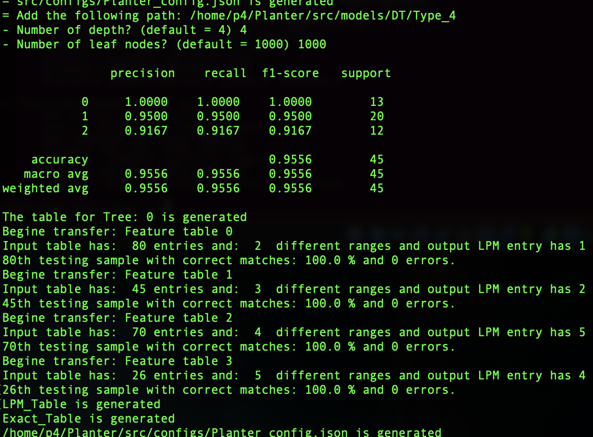
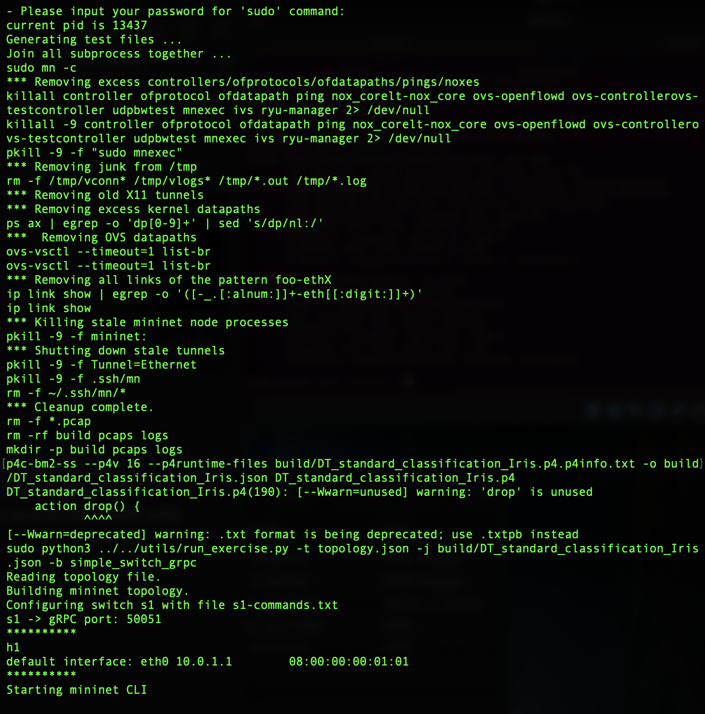
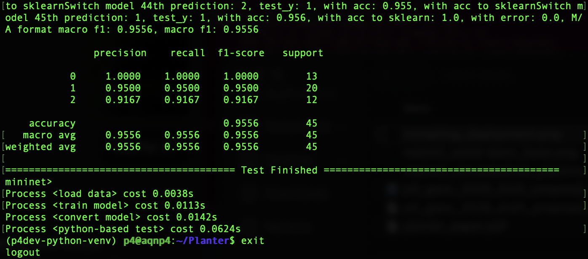

# Qualification Task: End-to-End Planter Workflow on BMv2

## Overview

This documents the completion of the alternative qualification task for GSoC 2026 Project 3.3 (Integrating P4-based In-Network Machine Learning framework into P4Pi). The task required completing an end-to-end Planter workflow — from data loading through to functional testing on a BMv2 software switch.

## Environment

- **Host:** MacBook (Apple Silicon) running VirtualBox
- **VM:** Ubuntu 24.04 LTS (aarch64)
- **Python:** 3.12 (virtualenv: p4dev-python-venv)
- **P4 Compiler:** p4c-bm2-ss v1.2.5.10 (SHA: d59f5b2e9)
- **Software Switch:** simple_switch_grpc v1.15.0 (BMv2, build 6c7c93e5)
- **Network Emulator:** Mininet 2.3.1b4
- **Framework:** Planter v0.1.0
- **Access:** SSH into VM via port forwarding (port 2222) with key-based authentication for efficient terminal workflow

### Dependencies

| Package | System Python | Venv |
|---|---|---|
| numpy | 2.4.3 | 2.4.3 |
| scikit-learn | 1.8.0 | 1.8.0 |
| pandas | 3.0.1 | 3.0.1 |
| scipy | 1.17.1 | 1.17.1 |
| matplotlib | 3.10.8 | 3.10.8 |
| seaborn | 0.13.2 | 0.13.2 |
| scapy | 2.7.0 | 2.5.0 |
| grpcio | 1.51.1 | — |
| protobuf | 4.21.12 | — |

## Configuration

| Parameter | Value |
|---|---|
| Model | Decision Tree (DT) |
| Variation | Type 4 (legacy — LPM-based) |
| Dataset | Iris (4 features, 3 classes, 150 samples) |
| Architecture | v1model |
| Use Case | standard_classification |
| Target | BMv2 (software mode) |
| Tree Depth | 4 |
| Max Leaf Nodes | 1000 |
| Testing Mode | Enabled (max 20000 input, 5000 test) |

### Why These Choices

- **DT Type 4** is marked `[legacy]` in the Planter manual, meaning it's the stable, well-tested Decision Tree variation. It uses LPM (Longest Prefix Match) entries to reduce table sizes — a good fit for BMv2.
- **Iris dataset** is Planter's standard demo dataset with 4 features and 3 classes of flowers. Small enough for fast iteration but sufficient to verify the full pipeline.
- **standard_classification** is the correct use case for numbered type variations. The `performance` use case is only for EB/LB/DM variations.
- **v1model + bmv2** is the standard P4 platform combination for software switch testing.

## Workflow Steps

### Step 1: Data Loading

Planter loaded the Iris dataset from `~/Data/Iris/Iris.csv` and split it into training (105 samples) and testing (45 samples) sets with 4 features each.

```
= The shape of the dataset - train x: (105, 4) train y: (105,)
                              test x: (45, 4)  test y: (45,)
```



### Step 2: Model Training (Matrix 1 — scikit-learn baseline)

Planter trained a Decision Tree classifier using scikit-learn. This is the baseline Python model performance:

```
               precision    recall  f1-score   support
           0     1.0000    1.0000    1.0000        13
           1     0.9500    0.9500    0.9500        20
           2     0.9167    0.9167    0.9167        12
    accuracy                         0.9556        45
```



### Step 3: Model Conversion (M/A Table Generation)

Planter converted the trained decision tree into P4-compatible Match/Action table entries using LPM encoding. Each of the 4 Iris features was mapped to a separate feature table:

- Feature table 0: 80 input entries → 1 LPM entry
- Feature table 1: 45 input entries → 2 LPM entries
- Feature table 2: 70 input entries → 5 LPM entries
- Feature table 3: 26 input entries → 4 LPM entries

All feature tables passed validation with 100% correct matches and 0 errors.

Final table stats: 13 exact match entries, 12 ternary match entries.

### Step 4: Simulated Pipeline Test (Matrix 2 — Python-simulated M/A logic)

Planter tested the generated table entries using Python-simulated pipeline logic to verify the conversion preserved accuracy:

```
The accuracy of the match action format of Decision Tree is 0.9556
acc to sklearn: 1.0 (perfect match with baseline)
```

The M/A table entries produce identical results to the original scikit-learn model.


### Step 5: P4 Code Generation

Planter generated the complete P4 program (`DT_standard_classification_Iris.p4`) targeting v1model architecture, along with control plane table loading scripts.

### Step 6: Compilation & Deployment

The P4 code was compiled with p4c-bm2-ss and deployed on BMv2 (simple_switch_grpc) inside a Mininet topology:

```
p4c-bm2-ss --p4v 16 --p4runtime-files build/DT_standard_classification_Iris.p4.p4info.txt \
  -o build/DT_standard_classification_Iris.json DT_standard_classification_Iris.p4
```

Compilation succeeded with only a minor unused action warning and a deprecation notice about `.txt` format.



### Step 7: Functional Testing on BMv2 (Matrix 3 — actual switch inference)

All 45 test samples were sent as packets through the BMv2 switch. The switch parsed each packet, extracted features, performed inference using the M/A tables, and returned predictions:

```
Switch model 45th prediction: ... acc to sklearn: 1.0,
  M/A format macro f1: 0.9556, macro f1: 0.9556

               precision    recall  f1-score   support
           0     1.0000    1.0000    1.0000        13
           1     0.9500    0.9500    0.9500        20
           2     0.9167    0.9167    0.9167        12
    accuracy                         0.9556        45
```



## Results Summary

| Stage | Accuracy | Match to sklearn |
|---|---|---|
| Matrix 1: scikit-learn baseline | 95.56% | — |
| Matrix 2: Simulated M/A pipeline | 95.56% | 100% |
| Matrix 3: BMv2 switch inference | 95.56% | 100% |

All three matrices produced identical classification results, confirming that the Planter framework correctly converted the Decision Tree model into P4 M/A tables and that the generated P4 program runs correctly on BMv2.

## Process Timing

```
Process <load data>          cost 0.0038s
Process <train model>        cost 0.0113s
Process <convert model>      cost 0.0142s
Process <python-based test>  cost 0.0624s
```

## Issues Encountered & Fixes

1. **Missing `~/Data/Iris/Iris.csv`**: Planter expects the dataset in a separate `~/Data` directory outside the repo. Downloaded from the Planter GitHub repository.

2. **Outdated `packages.txt`**: Planter's pinned dependency versions (e.g., `scipy==1.5.2`, `numpy==1.17.3`) are incompatible with Python 3.12. Installed latest versions of all packages manually.

3. **matplotlib style deprecation**: `plt.style.use('seaborn')` renamed to `'seaborn-v0_8'` in newer matplotlib. Fixed in `table_generator.py`.

4. **pandas API change**: `.max()[0]` no longer works with string-indexed Series in newer pandas. Replaced with `.max().iloc[0]` in `table_generator.py`.

5. **System Python vs venv**: Planter runs the BMv2 test script with `sudo python3`, which uses system Python — not the virtualenv. All test dependencies (scapy, numpy, scikit-learn, etc.) needed to be installed for system Python separately.

6. **Missing `p4.tmp` module**: The `p4runtime` pip package doesn't include `p4.tmp.p4config_pb2`. Copied from the venv's p4 package to `/usr/local/lib/python3.12/dist-packages/p4/tmp/`.

## Files Included

- [`DT_standard_classification_Iris.p4`](DT_standard_classification_Iris.p4) — the generated P4 program
- [`Planter_config.json`](Planter_config.json) — full run configuration (password redacted)
- [`log.json`](log.json) — classification results log
